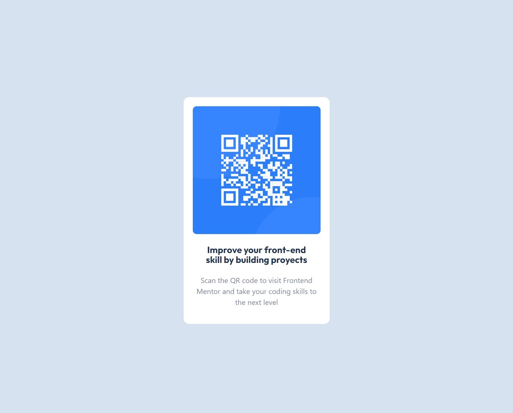

# Make It Real - QR Code Component

This is a solution to the  Qr Code Conponent project of the Make It Real course.

## Table of contents

- [Overview](#overview)
  - [The challenge](#the-challenge)
  - [Screenshot](#screenshot)
- [My process](#my-process)
  - [Built with](#built-with)
  - [What I learned](#what-i-learned)
  - [Continued development](#continued-development)
  - [Useful resources](#useful-resources)
- [Author](#author)
- [Acknowledgments](#acknowledgments)


## Overview

### The challenge


## Reto

Su desafío es construir este componente de código QR y lograr que se parezca lo más posible al diseño.

Puedes usar cualquier herramienta que te guste para ayudarte a completar el desafío. Entonces, si tienes algo que te gustaría practicar, no dudes en intentarlo.

Tus usuarios deberían poder:

- Ver el diseño óptimo para el componente según el tamaño de pantalla de su dispositivo

## Diseño

Los diseños están en formato JPG estático. El uso de archivos JPG significará que deberá usar su mejor criterio para estilos como "tamaño de fuente", "padding" y "margen".

### Style Guide

Los diseños se crearon con los siguientes anchos:

- Mobile: 375px
- Desktop: 1440px

## Colores

### Primary

- White: hsl(0, 0%, 100%)
- Light gray: hsl(212, 45%, 89%)
- Grayish blue: hsl(220, 15%, 55%)
- Dark blue: hsl(218, 44%, 22%)

## Tipografía

### Body Copy

- Font size (paragraph): 15px

### Font

- Family: [Outfit](https://fonts.google.com/specimen/Outfit)
- Weights: 400, 700

### Screenshot
 My Solution



## My process

### Built with

- Utilicé framework de React
- utilicé estilos de CSS

### What I learned

YO prendí a utilizar componentes

```javascript
    function App() {
    return (
        <>
        <QrCodeComponent/>
        </>
    )
}

```
```javascript
   const QrCodeComponent = () => {
    return (
        <>
            <div className="card">
                
                <h1>Improve your front-end skill by building proyects</h1>
                <p> Scan the QR code to visit Frontend Mentor <span>and take your coding skills to</span>  <span>the next level</span></p>
            </div>
        </>
    )
}

export default QrCodeComponent;


```


### Continued development

Seguiré  explorando React, para aprender bien su funcionamiento

## Author

Leidy Tatiana Cardona
